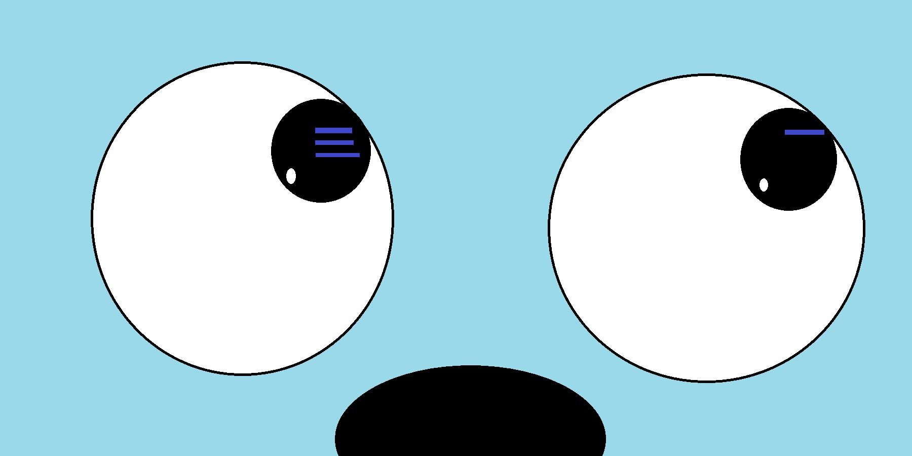

# MoGo

    

 
MoGo is the younger brother of Mocha (another bot I made).
 
MoGo can short your links using the <a href="https://github.com/Tch1b0/LinkShort">LinkShort API</a>.

## How to use

You can invite MoGo with clicking on this link:  
https://discord.com/oauth2/authorize?client_id=846694178674966549&scope=bot&permissions=8