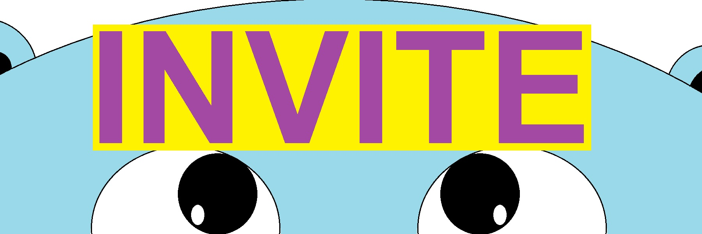

# MoGo
<p align="center">
    
</p>
<br>

## Purpose
This is a **Discord bot** designed to **automatically** make shortcuts for you
using the <a href="https://github.com/Tch1b0/LinkShort">LinkShort API</a>.

## Short introduction
You can just write message like you are used to.<br>
If a link appears that is **longer than 35 characters**, Mogo will automatically shorten it for you.

Use `$commands` in a Discord server where **MoGo** is also a member, to get a list of all commands. 

## Host on your own
Replace `<token>` with your bot token.

```sh
$ git clone https://github.com/Tch1b0/MoGo

$ cd ./MoGo

$ echo <token> > token.txt

$ docker-compose up -d
```

## Invite MoGo
<a href="https://discord.com/oauth2/authorize?client_id=846694178674966549&scope=bot&permissions=216128"></a>
